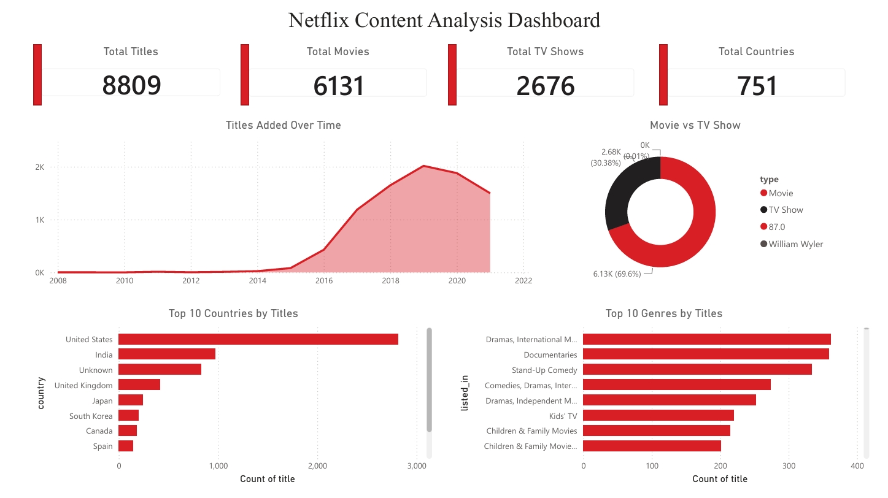

# Netflix Content Analysis Dashboard

Power BI dashboard analyzing the Netflix titles dataset (8,800+ titles).

## What I did
- Cleaned raw data in Python/pandas — handled mixed-format dates, split the duration column into movie minutes and TV seasons, filled missing values
- Built a Date table and relationships in Power BI
- Created DAX measures for content breakdowns (Total Titles, Movies, TV Shows, Countries)
- Designed a Netflix-themed dashboard with KPI cards, a trend line, donut chart, and top-10 breakdowns by country and genre
- Added interactive slicers for Year, Type, and Rating

## Dashboard preview

## Tools
Python (pandas) • Power BI Desktop • DAX • Power Query

## Files
- `netflix_dashboard.pbix` — Power BI file
- `netflix_cleaning.ipynb` — Python data cleaning notebook
- `netflix_titles.csv` — raw dataset
- `netflix_cleaned.csv` — cleaned dataset

